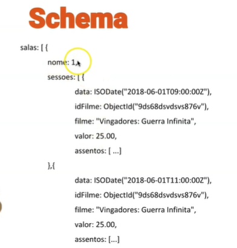
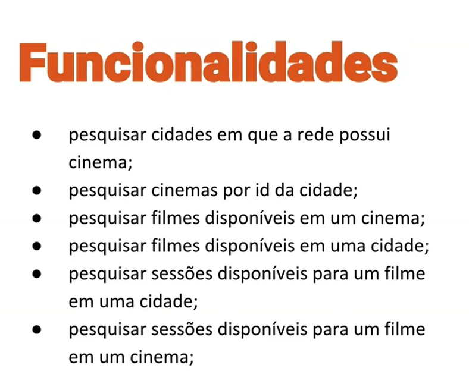
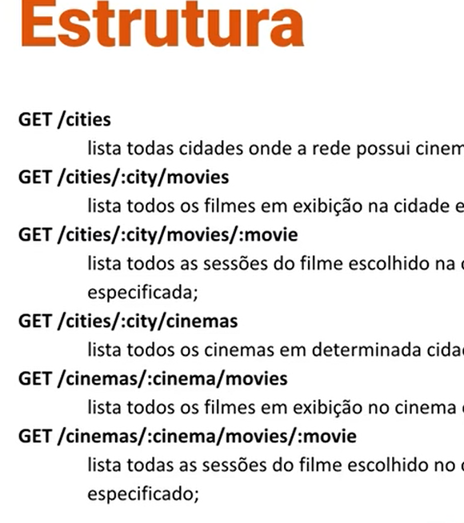

Esse codigo tem teste realizado no modulo depende do funcinonamento do mongodb para funcionar.
Por isso nao define-se esse teste como teste unitario , mas sim testes de integracao (o database.js)
ou seja depende de elementos de infraestutura.

Como rodar um html:
https://stackoverflow.com/questions/74452866/how-preview-a-html-file-github-codespaces

# Movies Services

Comentario:
    Por boa pratica deveria-se copiar os modulso entre os diferentes microservicos. Por exemplo suponha que um microservico use a mesma library que outro , caso um deles preecise de uma alteracao na library pode afetar o outro que nao precisa dessa alteracao. 

Componentes :
## MongoDB
## Server
## Api
## Index

# Mongo

[Repositorio]("./src/repository") - padrao de projeto para bancos nao relacionais 

funcoes :

getAllMovies()
getMovieById()
getMOviesPremieres()

# Server 

[Server]("./src/server/") 

Express - para servidor
Morgan - pra fazer logs de requisicoes no console
helmet - para proteger a api

Comentario :
    Saiba o foco do testes do modulo , ex: teste de banco - consegue se conectar?
    testes de api - as rotas funcionam, server - ele faz start e stop ?
    Fazemos isso atraves de **MOCKS**.
    
    **MOCKS** : simulacao de objetos , de dados ... afim de verificar nos testes automatizados.

# Cinema Catolog

O usuario quer ver os filme em cartaz na cidade do user. Tera que ter codigo do pais tambem , tera varios cinemas. Quando tem um dado em que a mudanca nao e tao frequente , esperasse que exista uma copia da info pra cada banco . Quando um dado e mudado com frequencia ai e bom ter comandos de atualziacao nas consultas.

